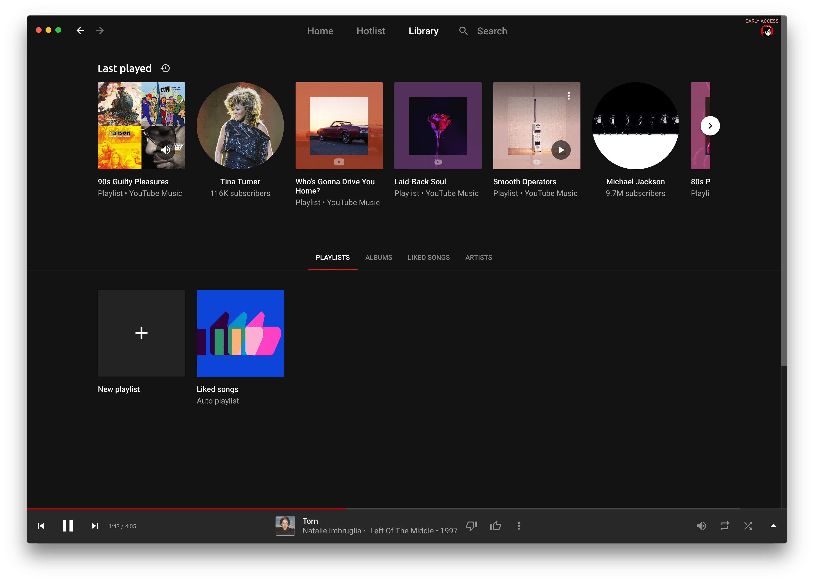

   

A simple Mac app wrapper using `WKWebView` for [YouTube Music](https://music.youtube.com) that allows YouTube Music to run as a standalone process. 

## Features

- Media Keys
- Keyboard shortcuts
- "Now Playing" Notification Center widget
- Touch Bar media controls and scrubber
- System notifications when a new track plays

## Installation

You can download the latest version at the following link:

[Download Latest Version](https://github.com/steve228uk/YouTube-Music/releases/latest)

The latest binary can also be found on the releases page or clone and compile in Xcode.

### Homebrew

If [homebrew](https://brew.sh) is installed, you can also use `brew install --cask yt-music`

## Screenshots

View More Screenshots

## Contributing

More help in improving YouTube Music is always welcome! Please take a look at the [Issues](https://github.com/steve228uk/YouTube-Music/issues) and if there's something you think you can do, please consider filing a [pull request](https://github.com/steve228uk/YouTube-Music/pulls).

### Requirements for Building

* [Xcode](http://developer.apple.com/download/more/) - To build the project
* [CocoaPods](https://cocoapods.org) - To download all of the dependencies
* An [Apple Developer Account](https://developer.apple.com) - To sign debug builds of the app.

### Building YouTube Music

1. Clone a copy of this repo.
2. In Terminal, `cd` to the repo directory and run `pod install`.
3. Open `YT Music.xcworkspace`.
4. Under the 'Code Signing' settings in Xcode, make sure your developer account is set for Debug builds.

## Legal

Disclaimer: YT Music is an unofficial application and not affiliated with YouTube or Google Inc. in any way. "YouTube", "YouTube Music" and the "YouTube Logo" are registered trademarks of Google Inc.
